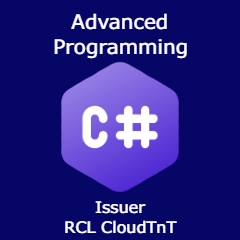

# Title

[Advanced Programming With C#](./badgeClass/advanced-programming-with-csharp.json)

# Badge Image

PNG 240 x 240 px

# Version

1.0

# Status

Active

# Issuer

[RCL CloudTnT](../issuer/profile.json)

# Code

AA-03

# Group

[Programming With The .NET Framework](./net-programming.md)

# Description

The badge is issued to recipients who demonstrate competence in developing Advanced Programs with C#.

# Competences

The recipient should be able to :

- Write Advanced Programmes with :

    - Delegates
    - Events
    - Func
    - Action
    - Lamda Expressions
    - Generics
    - Attributes
    - out
    - String Interpolation
    - Discards
    - Extensions
    - Asynchronous

# Evidence

The evidence for this badge will comprise of a project that includes the use of advanced programming with C#. The project should be an ASP.NET Core web application designed for personal, employer or customer use. The project should be available for review on GitHub.

The recipient will be assessed via a one-on-one online meeting. The recipient will be:

- Interviewed on the completed project