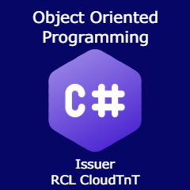

# Title

[Object Oriented Programming With C#](./badgeClass/object-oriented-programming-with-csharp.json)

# Badge Image

PNG 240 x 240 px

# Version

1.0

# Status

Active

# Issuer

[RCL CloudTnT](../issuer/profile.json)

# Code

AA-02

# Group

[Programming With The .NET Framework](./net-programming.md)

# Description

The badge is issued to recipients who demonstrate competence in developing Objected Oriented Programs (OOP) with C#.

# Competences

The recipient should be able to :

- Write Object Oriented Programmes

# Evidence

The evidence for this badge will comprise of a completed project. The following evidence must be provided :

- A GitHub project containing a .NET Console application written in C#. The project should:

    - contain a description of what the application does
    - a ``Program.cs`` file containing the application code
    - the code should contain comments
    - the code should use object oriented programming

# Assessment

The recipient will be assessed through a review of a completed project.
