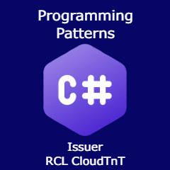

# Title

[Programming Patterns With C#](./badgeClass/programming-patterns-with-csharp.json)

# Badge Image

PNG 240 x 240 px

# Version

1.0

# Status

Active

# Issuer

[RCL CloudTnT](../issuer/profile.json)

# Code

AA-04

# Group

[Programming With The .NET Framework](./net-programming.md)

# Description

The badge is issued to recipients who demonstrate competence in using Programming Patterns with C#.

# Competences

The recipient should be able to :

- Use the following programming patterns :

    - Single Responsibility Principle
    - Open for Extension, Closed for Modification
    - Liskov Substitution Principle
    - Interface Segregation Principle
    - Dependency Inversion Principle
    - Dependency Injection
    - Factory Method
    - Builder
    - Singleton
    - Facade

# Evidence

The evidence for this badge will comprise of a project that includes the use of programming patterns with C#. The project should be an ASP.NET Core web application designed for personal, employer or customer use. The project should be available for review on GitHub.

The recipient will be assessed via a one-on-one online meeting. The recipient will be:

- Interviewed on the completed project