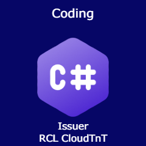

# Title

[Writing Code With C#](./badgeClass/writing-code-with-csharp.json)

# Badge Image

PNG 240 x 240 px

# Version

1.0

# Status

Active

# Issuer

[RCL CloudTnT](../issuer/profile.json)

# Code

BA001

# Group

[Programming With The .NET Framework](./net-programming.md)

# Description

The badge is issued to recipients who demonstrate competence in writing code with C#.

# Competences

The recipient should be able to :

- Write C# code using *types*. Types will include :
    - string
    - int
    - long
    - decimal
    - double
    - bool
    - DateTime

- Write C# code using *statements*. Statements will include

    - if – else
    - do - while
    - for
    - foreach

# Evidence

The evidence for this badge will comprise of a completed project. The following evidence must be provided :

- A GitHub project containing a .NET Console application written in C#. The project should:

    - contain a description of what the application does
    - a ``Program.cs`` file containing the application code
    - the code should contain comments
    - the code should use at least 3 *types*
    - the code should use at least 2 *statements*

Please refer to this [sample project]() as a guide.

# Assessment

The recipient will be assessed through a review of a completed project:
